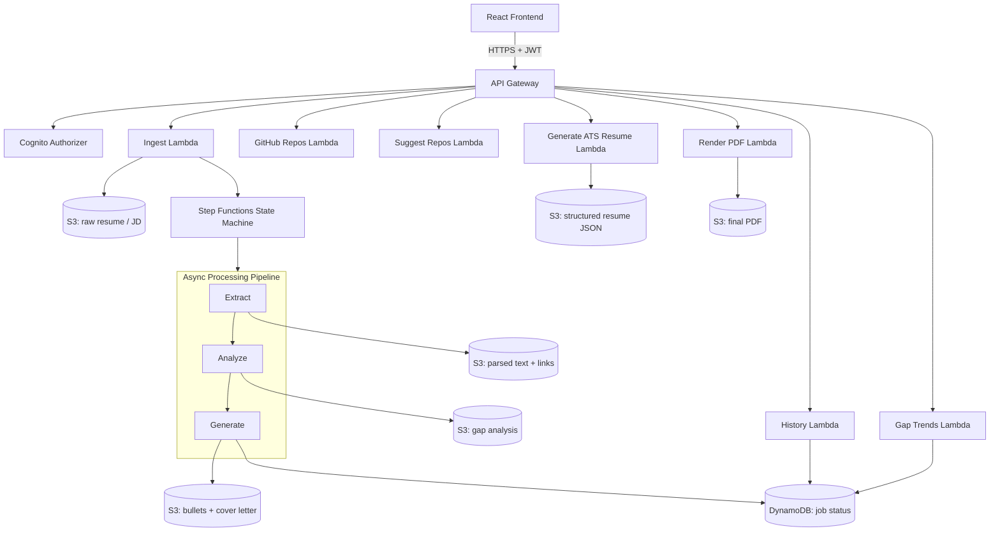
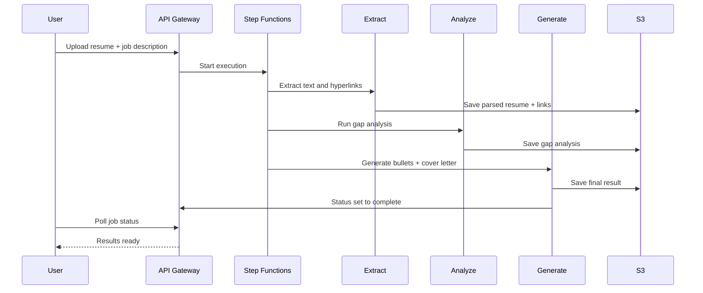
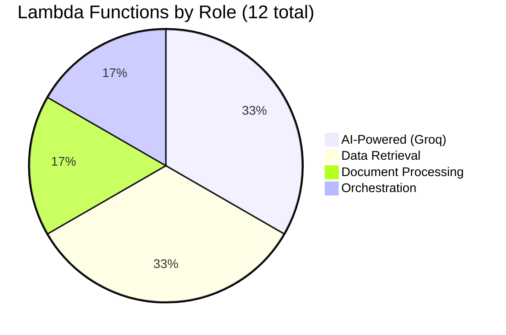

# Job Tailor

An AI-powered tool that analyzes how well a resume matches a job posting, then generates tailored resume bullet rewrites, a draft cover letter, and a full ATS-optimized PDF resume — grounded in the user's real experience, with a guardrail against fabricating skills or accomplishments they don't have.

**Live demo:** https://job-tailor-two.vercel.app/

[](https://aws.amazon.com/)
[](https://www.terraform.io/)
[](https://react.dev/)
[](https://groq.com/)

## What it does

1. **Secure Authentication:** User accounts powered by AWS Cognito to securely store history and trends.
2. **Upload & Paste:** Upload your resume PDF and paste the target job description.
3. **Extraction & Analysis:** The system locally extracts text and hyperlinks from your resume, scores the match against the JD, and identifies honest gaps.
4. **Tailoring:** Rewrites 3-5 resume bullets to mirror JD language *without* inventing experience you don't have, and drafts a tailored cover letter.
5. **Job History & Gap Trends:** Track your past applications and view an aggregated dashboard of your most frequent skill gaps across all jobs.
6. **GitHub Integration:** Fetches your GitHub repositories and uses AI to suggest the most relevant projects to highlight for the specific role.
7. **ATS Resume Generation:** Auto-generates a fully tailored ATS-friendly resume combining your base experience, tailored bullets, and selected GitHub projects, rendered as a downloadable, single-page PDF with working hyperlinks.

## Architecture



- **API Gateway & Lambdas:** Securely handles incoming requests (authenticated via Cognito JWTs). Kicks off async processing, serves job history, gap trends, GitHub proxies, and on-the-fly PDF generation.
- **S3:** Central storage for raw PDFs, parsed text, intermediate JSON structures, and the final generated ATS resumes.
- **DynamoDB:** Maintains job state (pending, complete, failed) and stores user-specific history.
- **Step Functions:** Orchestrates the multi-stage AI pipeline (Extract -> Analyze -> Generate). Features retries with exponential backoff and error routing for granular pipeline states.
- **Terraform:** Infrastructure as Code (IaC) to consistently provision all AWS resources.

### Processing pipeline



### Lambda breakdown



## A real engineering decision worth mentioning

This project was originally designed around AWS Textract (for PDF extraction) and AWS Bedrock (using Claude, for LLM calls). However, development hit an account-tier restriction — both services require a fully billable AWS account, and this project was built on a free-credits account with no payment method attached.

Rather than add a payment method for a portfolio project, I implemented a pragmatic, zero-cost fix:
- **Textract** was replaced with **local PDF parsing** via the `pdf-parse` npm library, plus `pdfjs-dist` for extracting hyperlink annotations (which `pdf-parse` drops), all within the Lambda. It achieves the same result with zero cost and no external dependencies.
- **Bedrock** was replaced with the **Groq API (Llama 3.3 70B)**. This required swapping the API call and auth mechanism while keeping the exact same JSON-schema prompting approach.

Crucially, **no architecture changes were required.** The Step Functions orchestration, error-handling design, and data flow remained completely identical. This is a deliberate demonstration of real infrastructure-constraint problem-solving.

## Tech Stack

- **Backend:** AWS Lambda (Node.js 18 ESM), API Gateway, Step Functions, Cognito, S3, DynamoDB, Terraform
- **AI:** Groq API (Llama 3.3 70B / GPT-OSS 120B) for analysis and generation, `pdf-parse` + `pdfjs-dist` for text and hyperlink extraction, `pdfkit` for PDF rendering
- **Frontend:** React, TypeScript, Vite, React Router

## Project Structure

```text
.
├── frontend/          # React + Vite application
├── infra/             # Terraform infrastructure definitions
└── lambdas/
    ├── analyze/             # Performs gap analysis via Groq API
    ├── extract/             # Extracts text and hyperlinks from PDF
    ├── gap-trends/          # Aggregates skill gap data for the user
    ├── generate/             # Generates tailored bullets and cover letter
    ├── generate-ats-resume/  # Generates full ATS-friendly resume content
    ├── github-repos/         # Fetches user's GitHub repositories
    ├── history/              # Fetches historical jobs for a user
    ├── ingest/               # API entrypoint, saves files, triggers Step Functions
    ├── mark-failed/          # Updates DynamoDB on pipeline failures
    ├── render-resume-pdf/    # Renders the final ATS resume into a downloadable PDF
    ├── status/                # Checks completion status of a running job
    └── suggest-repos/         # Groq-powered suggestion of GitHub repos based on JD
```

## Setup

### Prerequisites
- AWS CLI configured with active credentials
- Terraform 1.5+
- Node 18+
- A free Groq API key from [console.groq.com](https://console.groq.com)

### Backend Deployment
1. Navigate to the infra directory:
```bash
   cd infra
```
2. Initialize and apply Terraform:
```bash
   terraform init
   terraform apply -var="groq_api_key=your_groq_api_key_here"
```
   *(Note the outputs for API Gateway URL, User Pool IDs, and S3 bucket names once complete)*

### Frontend Setup
1. Navigate to the frontend directory:
```bash
   cd frontend
```
2. Create a `.env` file and add your AWS resources (using outputs from terraform):
```env
   VITE_API_BASE_URL=your_api_gateway_invoke_url
   VITE_COGNITO_USER_POOL_ID=your_cognito_pool_id
   VITE_COGNITO_CLIENT_ID=your_cognito_client_id
   VITE_COGNITO_REGION=us-east-1
```
3. Install dependencies and start the dev server:
```bash
   npm install
   npm run dev
```
